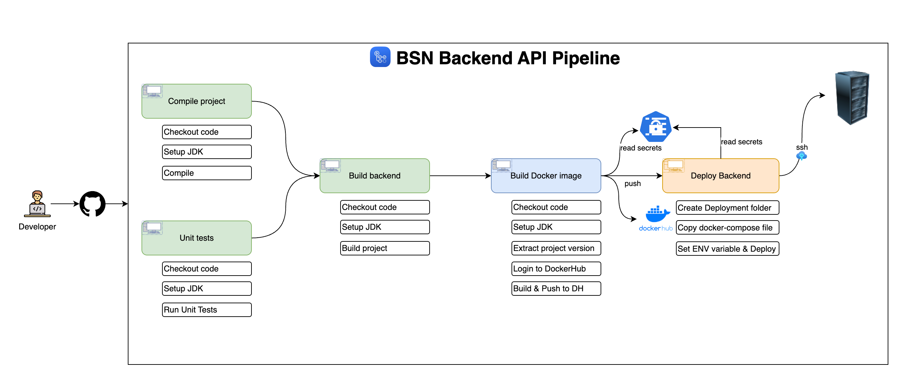

# Book Manager - Backend

## Table of Contents

- [Overview](#overview)
- [Features](#features)
- [Technologies Used](#technologies-used)
- [Learning Objectives](#learning-objectives)
- [License](#license)
- [Getting Started](#getting-started)
- [Contributors](#contributors)
- [Acknowledgments](#acknowledgments)

## Overview

**Book Manager** est une application backend conçue pour gérer des collections de livres et faciliter leur partage au sein d’une communauté. Le système prend en charge des fonctionnalités telles que l’enregistrement des utilisateurs, la gestion des livres (ajout, mise à jour, partage et archivage), l’emprunt et le retour des livres avec des vérifications d'éligibilité, et bien plus.

Ce projet se concentre exclusivement sur le backend, développé avec **Spring Boot 3** et **Spring Security 6**. Un frontend pourrait être envisagé dans le futur pour compléter l’expérience utilisateur.

## Features

- **Enregistrement des utilisateurs** : Créez un compte utilisateur.
- **Validation d'email** : Activez les comptes via des codes de validation sécurisés.
- **Authentification des utilisateurs** : Connectez-vous à l'aide de JWT pour une sécurité renforcée.
- **Gestion des livres** :
    - Ajouter, mettre à jour, partager, et archiver des livres.
- **Emprunt de livres** : Vérifie la disponibilité des livres avant l'emprunt.
- **Retour des livres** : Gestion des retours des livres empruntés.
- **Approbation des retours** : Fonctionnalité dédiée à l'approbation des retours.

### Diagrammes

- **Diagramme de classes**  
  

- **Architecture de sécurité Spring**  
  

- **Pipeline backend**  
  

## Technologies Used

### Backend

- **Spring Boot 3**
- **Spring Security 6**
- **JWT Token Authentication**
- **Spring Data JPA**
- **JSR-303 & Spring Validation**
- **OpenAPI & Swagger UI Documentation**
- **Docker**
- **GitHub Actions**
- **Keycloak**

## Learning Objectives

En suivant ce projet, vous apprendrez à :

- Concevoir un diagramme de classes à partir d'exigences métier.
- Sécuriser une application avec des tokens JWT et Spring Security.
- Enregistrer des utilisateurs et valider des comptes par email.
- Implémenter une gestion avancée des exceptions métier et système.
- Valider les données avec JSR-303 et Spring Validation.
- Documenter vos APIs avec OpenAPI et Swagger UI.
- Dockeriser votre infrastructure backend.
- Mettre en place un pipeline CI/CD avec GitHub Actions.
- Optimiser une architecture backend RESTful avec pagination et bonnes pratiques.

## Getting Started

Pour commencer avec ce projet backend, suivez les instructions de configuration disponibles dans le répertoire principal :  
[Backend Setup Instructions](/book-manager/README.md)

## Contributors

- [Kamga Brandon](https://github.com/brandoniscoding-dev)